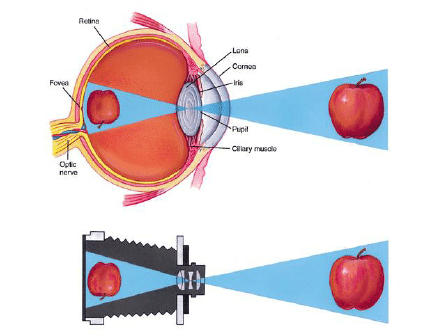
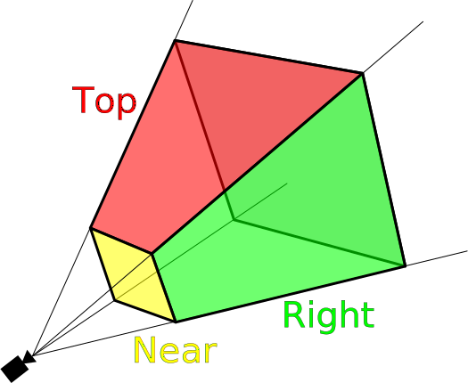
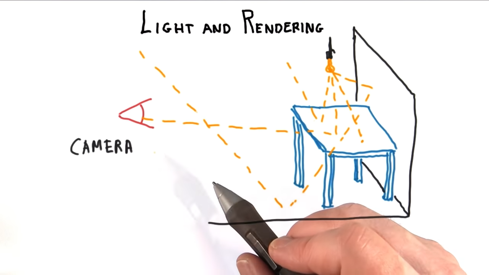
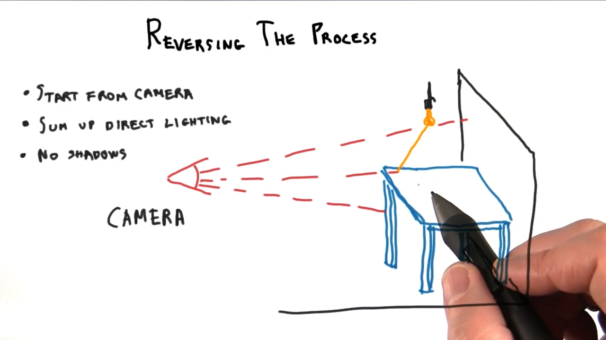
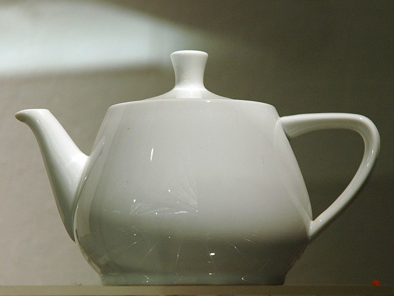
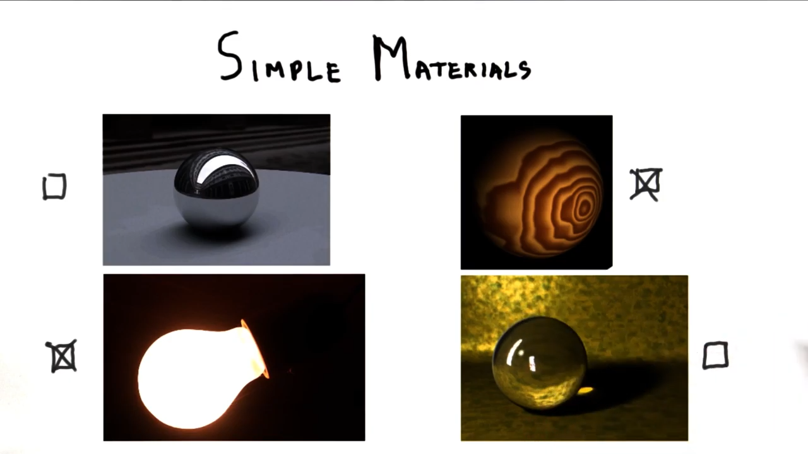
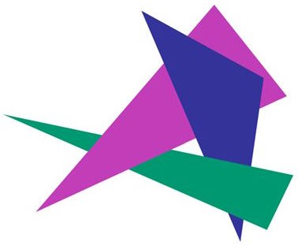
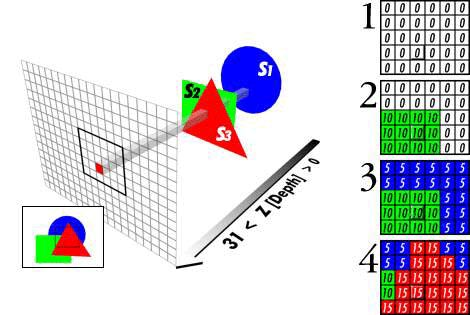

# Lesson 1: Introduction

Eric Haines' blog:
http://www.realtimerendering.com/blog/

## Interactive 3D Rendering

Rendering - Depict or create an image.
3D - Define things in a 3D world, and render onto a 2D screen.
Interactive - Influence or affect something in a 3D virtual world.

## WebGL
Web **G**raphics **L**ibrary.

http://get.webgl.org/

## Core Ideas

* Refresh rate, frames per second.
* The eye, pinhole camera, view frustrum
* Light: Physical and Virtual
* The graphics pipeline
* Painter's algorithm & Z-Buffer

## Refresh Rate and FPS

Minimum usable FPS should be 6 FPS.

Minimum for video games are 30 FPS or 60 FPS.

30 and 60 are not arbitrary and tied to hardware.

**Refresh Rate** - Most monitors refresh at 60 Hertz -- display the image 60 times per second.

Provides an upper-limit on the *frame rate*.

Applications can have a smaller frame rate than the refresh rate.

Demo:
http://www.realtimerendering.com/udacity/?load=demo/unit1-fps.js

## The Eye & Pinhole Camera

Image is upside down.

[image source](https://www.researchgate.net/figure/Optical-focusing-system-of-the-human-eye-and-a-photographic-camera-showing-the_fig1_224322366)

## View Frustum

A view frustum is a more convenient way to think of a camera for computer graphics.

Image is right-side up.

A [frustum](https://en.wikipedia.org/wiki/Frustum) is a pyramid with it's top chopped off.

Frequently mispelled with an "r" as "frust**r**um".

## 3D Scene

* Objects
  * Geometry + Material ➕ 🪵
* Lights 💡
* Camera 🎥

For an in-depth overview of how three.js labels elements in a scene:
http://ushiroad.com/3j/

## Light & Rendering

It'd be very expensive to track all the photons in a scene.

Only the photons reaching the camera are tracked.

* Start from the camera
* Cast a ray to a point and sum direct lighting
* No shadows

## The Teapot
Iconic object and symbol of 3D computer graphics.

[Martin Newell](https://en.wikipedia.org/wiki/Martin_Newell_(computer_scientist)), creator of the [Utah teapot](https://en.wikipedia.org/wiki/Utah_teapot).

Co-developed the [Painter's algorithm](https://en.wikipedia.org/wiki/Painter%27s_algorithm).

Inspired by a real live [Melitta](https://en.wikipedia.org/wiki/Melitta) teapot manufactured in 1974.

## Simple Materials

Render an image by finding what object is visible at each pixel, and finding how a light affects *just* that surface.

Which of the following objects can be rendered by that system:
* Shiny metallic ball ❌
* Wooden ball ✔️
* Light bulb ✔️
* Glass ball ❌

## Graphics Pipeline
A pipeline deals with objects separately.

GPU:
* **G**raphics
* **P**rocessing
* **U**nit

Application -> Camera & Model Transform -> Rasterization

1. Application sends objects to the GPU. Typically 3D triangles.
2. Triangles are modified by the camera's view of the world and any modeling transformations.
3. Translates triangle locations computed in step #2 into pixels.
  * Identifies all the pixels whose centers are inside the triangle.

### Pipeline Parallelism

Each object is dealt with once and independently.

Each step in the pipeline can be done independently (in parallel).

The worst performing step in the pipeline bottlenecks the entire pipeline.

A -> B -> C -> D
1    3    1    1

B is the **B**ottleneck in the pipeline since it takes the longest amount of time (i.e. 3 units of time instead of 1).

C is "*starving*", waiting for input on B.

A is "*stalling*", finished processing, but the object can't move on to B.

## Painter's Algorithm
Draw each object, on one top of the other.

1. Sort objects based on the distance to the camera, back to front.
2. Render the most distant object first, render the next closest object, then the next closest object, and the closest object to the camera last.

Has a serious limitation.

Cycles where each object is in front of the next.

## Z-Buffer
GPU solves the visibility problem using a [Z-Buffer](https://en.wikipedia.org/wiki/Z-buffering).

> Landscape paining is really just a box of air with little marks in it telling you how far back in that air things are.

- Lennart Anderson

Z - Distance from camera.

Buffer - Array

Each pixel gets a color and distance from the camera.

Z-Depth - floating point number, 0.0 to 1.0.
Where 0.0 is the closest to the eye and 1.0 is the maximum distance from the eye.

Z-Buffer intially set to all 1.0.

Objects are drawn from front to back for optimal performance.

