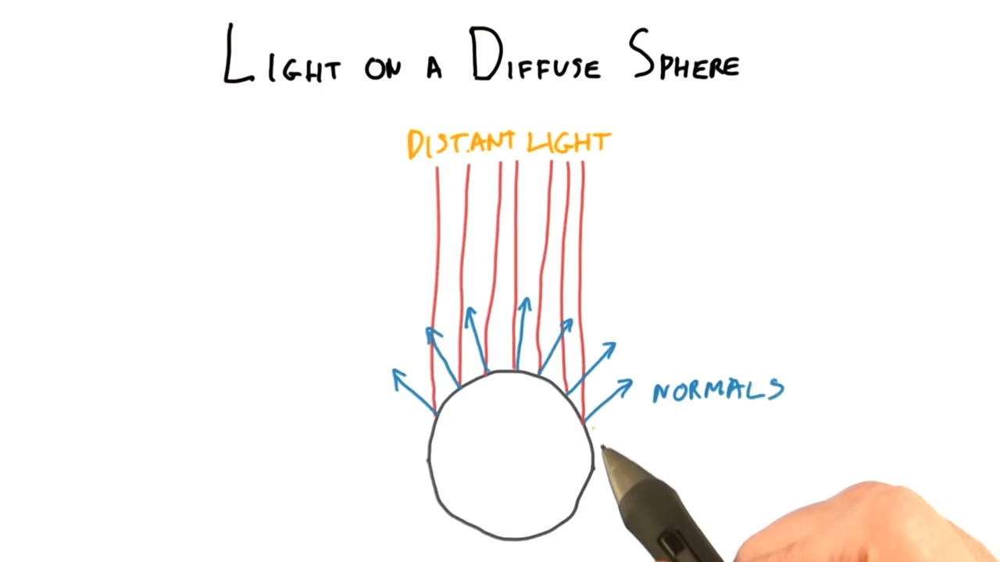
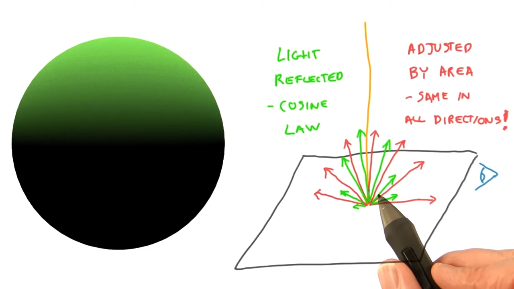
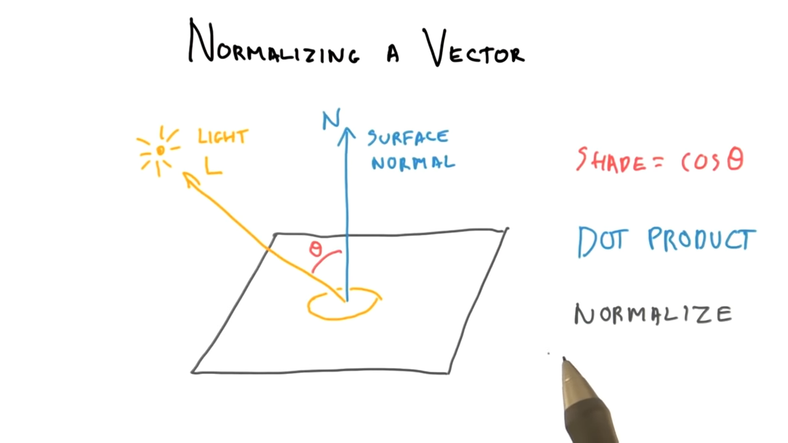
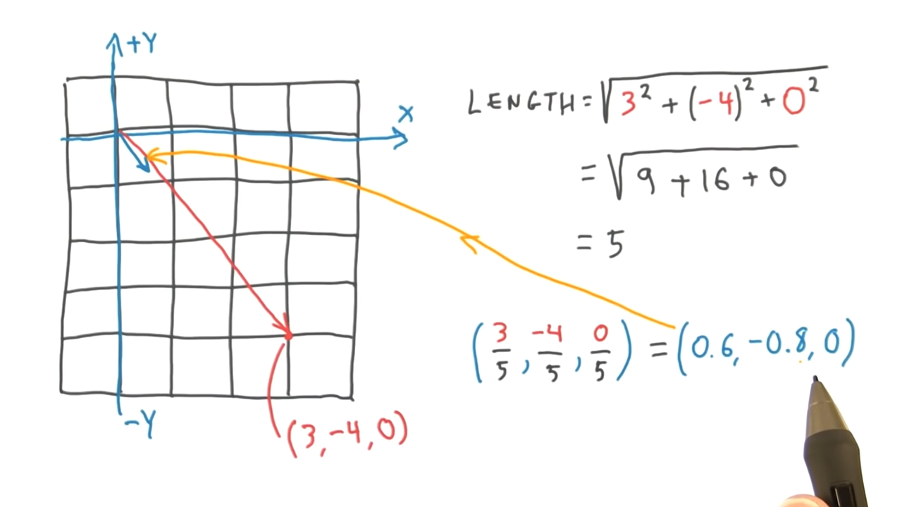
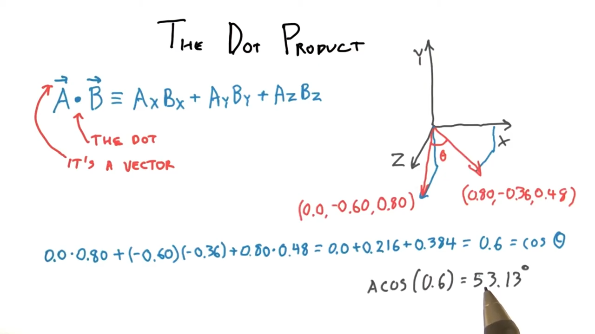

# Lesson 3: Colors and Materials

## Programmable Pipeline
Application -> Transform to Screen -> Rasterization -> **Color & Z-Depth**

1. Application sends triangle to the GPU.
2. GPU determines where a triangle's vertices are on the screen, including Z-depth.
3. Each pixel on the triangle is shaded.
4. If triangle passes the Z-Buffer test, then saved to the image and displayed.

Modern GPU's have certain parts of the pipeline that are programmable.

Transform to Screen -> **Vertex Shader**

Rasterization:
1. Triangle Setup
2. **Fragment Shader**

## RGB Color Definition

*Channels*:
* **R**ed
* **G**reen
* **B**lue

Sometimes order is BGR.

Colors are defined as:
* floating point numbers
* or integers

Examples (*floating point numbers*):
* (0.0, 0.0, 0.0) black
* (1.0, 1.0, 1.0) white
* (1.0, 0.0, 0.0) red
* (0.0, 1.0, 0.0) green
* (0.0, 0.0, 1.0) blue
* (1.0, 1.0, 0.0) yellow

Print or paints use *[Subtractive Color Mixing](https://en.wikipedia.org/wiki/Subtractive_color)* or [CYMK](https://en.wikipedia.org/wiki/CMYK_color_model).

Computer Graphics use *[Additive Color Mixing](https://en.wikipedia.org/wiki/Additive_color)* or [RGB](https://en.wikipedia.org/wiki/RGB_color_model).


## Vertex Attributes & Color Interpolation
Vertexes can have attributes like color, and Three.js will interpolate between vertexes.

This interpolation affects other attributes in addition to color.

## Color Gamut

Monitors have limits on the colors they can produce, and produce only a subset of the visible light spectrum.


CIE XYZ color space and device's color gamut.

[Mach bands](https://en.wikipedia.org/wiki/Mach_bands) form lines creating the device's color gamut in the CIE XYZ color space.

See [Gamut](https://en.wikipedia.org/wiki/Gamut) for more information.

## Simple Light Model

A material's appearance can be thought of by adding four components together:
1. **Emissive** - For coloring glowing objects. A light bulb has some constant color and other objects don't really affect.
2. **Ambient** - Compute a constant color value that is added to the fragment's final color. Adds some light or color to areas that are not well-lit or dark.
3. **Diffuse** - flat-matte finish. Determined by each light's location.
4. **Specular** - the shininess of an object. Affected by the viewer's location.

#3 and #4 are computed based on lights in the scene while #1 and #2 are essentially independent of these.

```
Surface Color =
Emissive +
Ambient +
For Each Light:
    Diffuse(Light) + Specular(Light, View)
```
```
C = E + A + Σ(D(L) + S(L, V))
```

## Light on a Diffuse Sphere





## Normalizing a Vector



To shade a diffuse surface, we need:

* the `cos` of the angle between the direction of the light and the surface normal.

Shade = cos(θ)

Dot Product - Vector operation that computes `cos` between `1` and `-1`.

Normalize - Rescaling a vector to a length of `1`.

Vector (3, -4, 0)

```
= sqrt(3^2 + (-4)^2 + 0^2)
= sqrt(9 + 16 + 0)
= sqrt(25)
= 5
```

Normalized Vector
= (3/5, -4/5, 0/5)
= (0.6, -0.8, 0)

Usually surface normals are stored as normalized vectors.



## Dot Product


