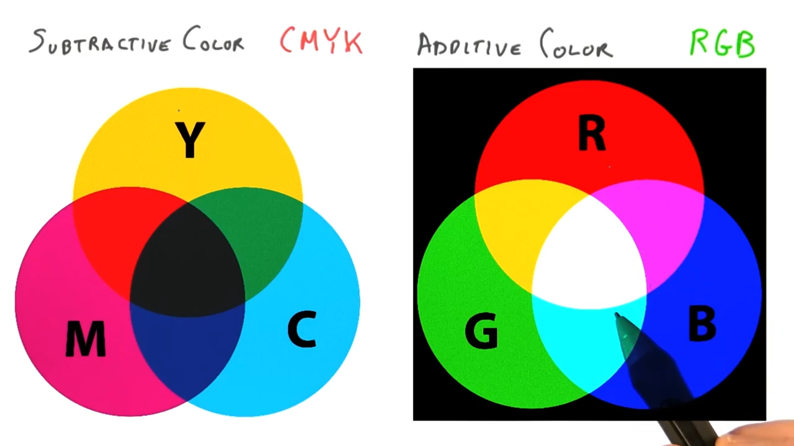

# Lesson 3: Colors and Materials

## Programmable Pipeline
Application -> Transform to Screen -> Rasterization -> **Color & Z-Depth**

1. Application sends triangle to the GPU.
2. GPU determines where a triangle's vertices are on the screen, including Z-depth.
3. Each pixel on the triangle is shaded.
4. If triangle passes the Z-Buffer test, then saved to the image and displayed.

Modern GPU's have certain parts of the pipeline that are programmable.

Transform to Screen -> **Vertex Shader**

Rasterization:
1. Triangle Setup
2. **Fragment Shader**

## RGB Color Definition

*Channels*:
* **R**ed
* **G**reen
* **B**lue

Sometimes order is BGR.

Colors are defined as:
* floating point numbers
* or integers

Examples (*floating point numbers*):
* (0.0, 0.0, 0.0) black
* (1.0, 1.0, 1.0) white
* (1.0, 0.0, 0.0) red
* (0.0, 1.0, 0.0) green
* (0.0, 0.0, 1.0) blue
* (1.0, 1.0, 0.0) yellow

Print or paints use *[Subtractive Color Mixing](https://en.wikipedia.org/wiki/Subtractive_color)* or [CYMK](https://en.wikipedia.org/wiki/CMYK_color_model).

Computer Graphics use *[Additive Color Mixing](https://en.wikipedia.org/wiki/Additive_color)* or [RGB](https://en.wikipedia.org/wiki/RGB_color_model).

## Vertex Attributes & Color Interpolation
Vertexes can have attributes like color, and Three.js will interpolate between vertexes.

This interpolation affects other attributes in addition to color.

## Color Gamut

Monitors have limits on the colors they can produce, and produce only a subset of the visible light spectrum.

CIE XYZ color space and device's color gamut.

[Mach bands](https://en.wikipedia.org/wiki/Mach_bands) form lines creating the device's color gamut in the CIE XYZ color space.

See [Gamut](https://en.wikipedia.org/wiki/Gamut) for more information.
