# Lesson 3: Colors and Materials

## Programmable Pipeline
Application -> Transform to Screen -> Rasterization -> **Color & Z-Depth**

1. Application sends triangle to the GPU.
2. GPU determines where a triangle's vertices are on the screen, including Z-depth.
3. Each pixel on the triangle is shaded.
4. If triangle passes the Z-Buffer test, then saved to the image and displayed.

Modern GPU's have certain parts of the pipeline that are programmable.

Transform to Screen -> **Vertex Shader**

Rasterization:
1. Triangle Setup
2. **Fragment Shader**

## RGB Color Definition

*Channels*:
* **R**ed
* **G**reen
* **B**lue

Sometimes order is BGR.

Colors are defined as:
* floating point numbers
* or integers

Examples (*floating point numbers*):
* (0.0, 0.0, 0.0) black
* (1.0, 1.0, 1.0) white
* (1.0, 0.0, 0.0) red
* (0.0, 1.0, 0.0) green
* (0.0, 0.0, 1.0) blue
* (1.0, 1.0, 0.0) yellow

Print or paints use *[Subtractive Color Mixing](https://en.wikipedia.org/wiki/Subtractive_color)* or [CYMK](https://en.wikipedia.org/wiki/CMYK_color_model).

Computer Graphics use *[Additive Color Mixing](https://en.wikipedia.org/wiki/Additive_color)* or [RGB](https://en.wikipedia.org/wiki/RGB_color_model).

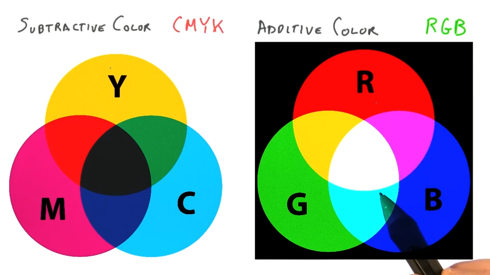

## Vertex Attributes & Color Interpolation
Vertexes can have attributes like color, and Three.js will interpolate between vertexes.

This interpolation affects other attributes in addition to color.

## Color Gamut

Monitors have limits on the colors they can produce, and produce only a subset of the visible light spectrum.


CIE XYZ color space and device's color gamut.

[Mach bands](https://en.wikipedia.org/wiki/Mach_bands) form lines creating the device's color gamut in the CIE XYZ color space.

See [Gamut](https://en.wikipedia.org/wiki/Gamut) for more information.

## Simple Light Model

A material's appearance can be thought of by adding four components together:
1. **Emissive** - For coloring glowing objects. A light bulb has some constant color and other objects don't really affect.
2. **Ambient** - Compute a constant color value that is added to the fragment's final color. Adds some light or color to areas that are not well-lit or dark.
3. **Diffuse** - flat-matte finish. Determined by each light's location.
4. **Specular** - the shininess of an object. Affected by the viewer's location.

#3 and #4 are computed based on lights in the scene while #1 and #2 are essentially independent of these.

```
Surface Color =
Emissive +
Ambient +
For Each Light:
    Diffuse(Light) + Specular(Light, View)
```
```
C = E + A + Σ(D(L) + S(L, V))
```

## Light on a Diffuse Sphere

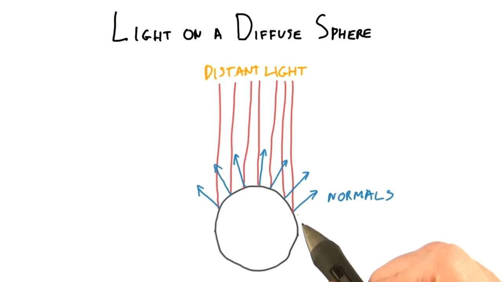

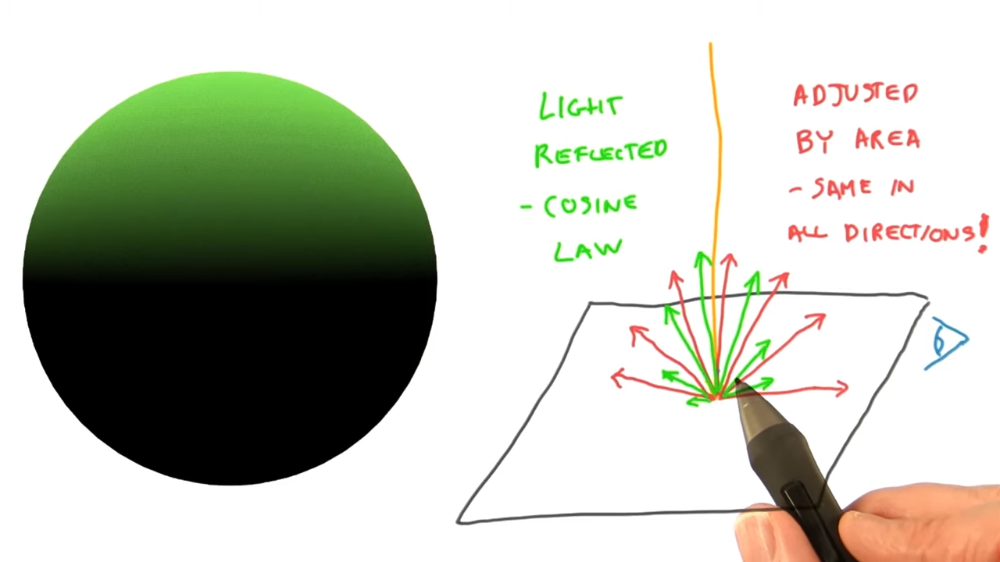

## Normalizing a Vector

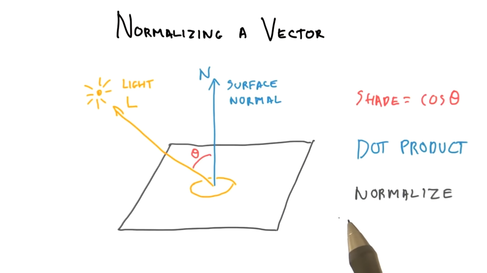

To shade a diffuse surface, we need:

* the `cos` of the angle between the direction of the light and the surface normal.

Shade = cos(θ)

Dot Product - Vector operation that computes `cos` between `1` and `-1`.

Normalize - Rescaling a vector to a length of `1`.

Vector (3, -4, 0)

```
= sqrt(3^2 + (-4)^2 + 0^2)
= sqrt(9 + 16 + 0)
= sqrt(25)
= 5
```

Normalized Vector
= (3/5, -4/5, 0/5)
= (0.6, -0.8, 0)

Usually surface normals are stored as normalized vectors.

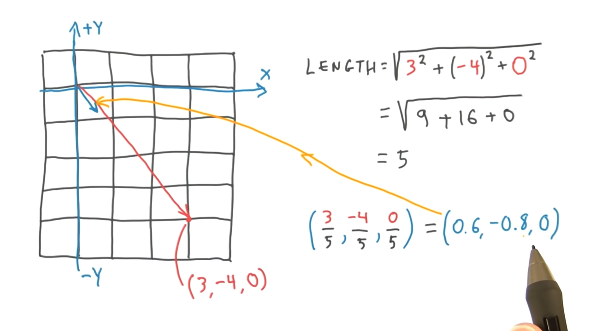

## Dot Product

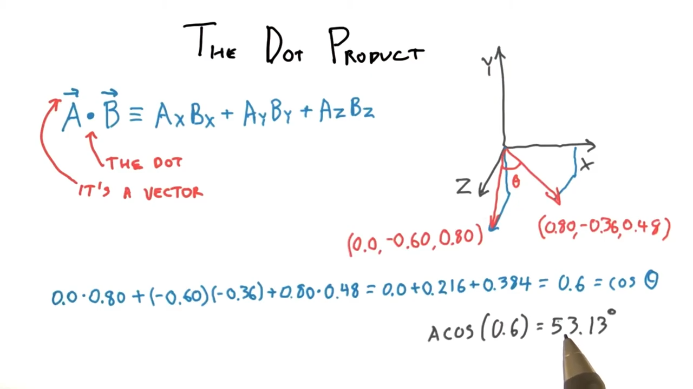

## Diffuse Material

`MeshBasicMaterial` is a solid color not affected by the lighting.

`MeshLambertMaterial`
```
C = Ambient + Color * Σ(N * Li)
```
Where *N* is the surface normal, Li is each light source, and we take the dot product between them.

In practice, *Emissive* is rarely used.

## Shading Normals

**Shading Normal** - make a tesselated surface look smooth.

**Geometric Normal** - each triangle has geometric normals at it's surface.

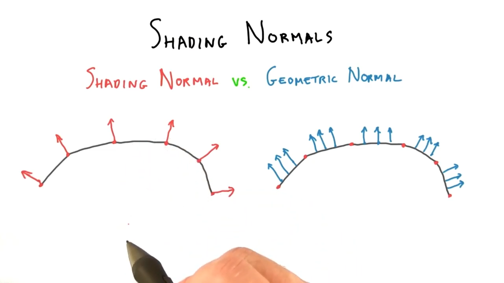

## Ka, Kd, and HSL

```
Fragment Color = Ka * Material + Kd * material * (N * Li)
```

Where:

* `Kd` is a scalar modifying the ***d**iffuse* cotribution.
* `Ka` is a scalar modifying the ***a**mbient* contrubution.
* `(N * L)` is a dot product of the normals and light sources.

**DEMO:** http://www.realtimerendering.com/udacity/?load=demo/unit3-lambert-demo.js


## Baking

To save on light calculations, if an object's orientation and all light's directions do not change, then you can pre-compute an RGB value for each pixel.

The eye or view does not affect the diffuse calculation.

## Specular Materials

Nearly diffuse:

* rough wood
* newspaper
* concrete
* mouse pad

Specular Materials (shiny or glossy):
* polished metals
* plastics
* polished wood
* glass
* glazed ceramics
* enamel paint

These materials look different when you view them from different angles.

Thus, we need to take into account the direction from the surface to the eye.

Simplified and Most Common Blinn-Phong Reflection Model
```
Specular = Max(N * H, 0)^s
```
Where:
* `N` - surface normals
* `H` - half angle factor (half way between light and eye)
* `s` - shininess factor (the greater the value, the more shiny the material) (`1` - `infinity`)

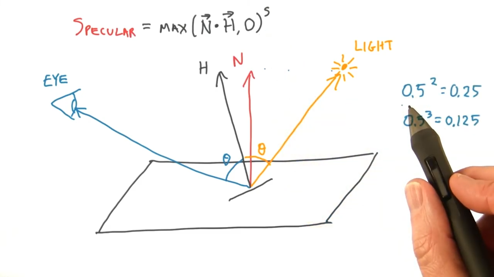

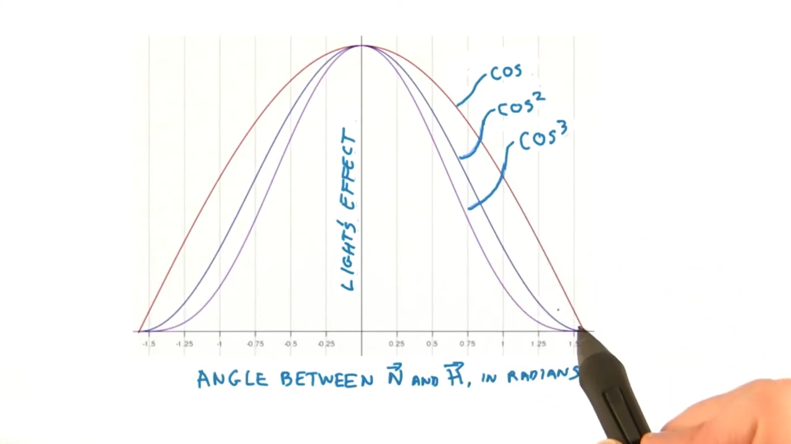

Smooth material on top, rough material on bottom.

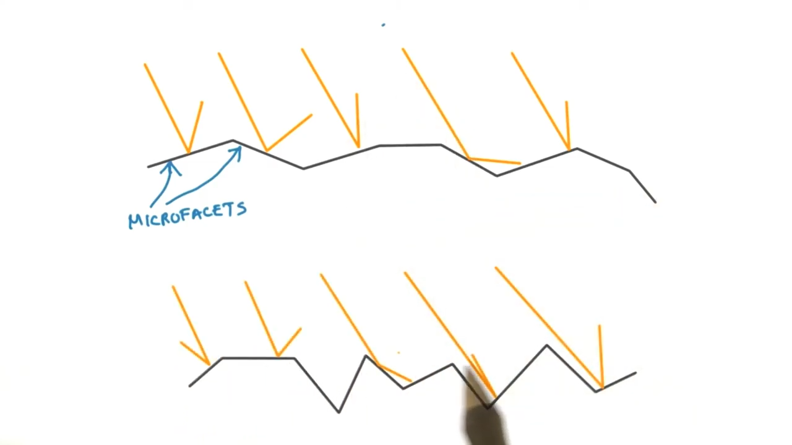

## Gouraud Shading

Compute lighting at vertices and interpolate between them.

Not very good as are eyes perceive creases called *[mach bands](http://en.wikipedia.org/wiki/Mach_bands)*.

To avoid this problem, we'd like to compute the lighting more frequently.

One way to do this is to increase the number of triangles that make up the surface.

"Gouraud interpolation" may be a better name. This matters mostly because there's Phong shading *and* Phong interpolation which are quite different things.

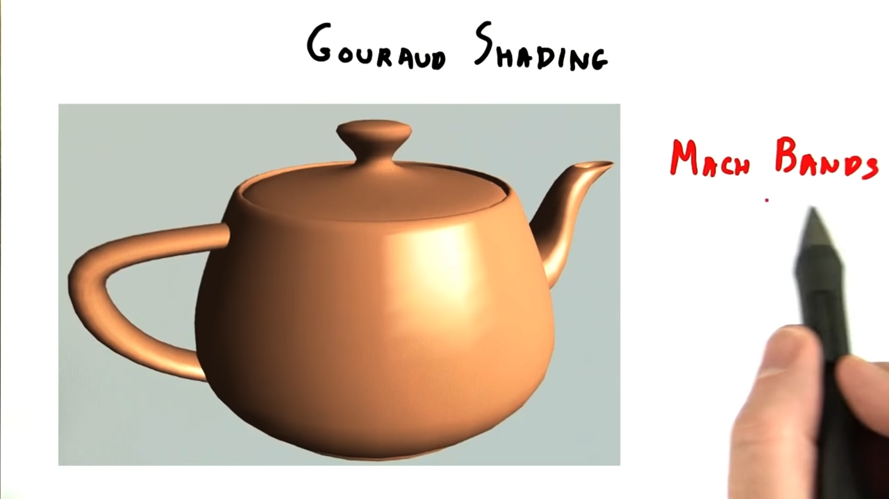

## Phong Interpolation
Ideally, we want to evaluate the reflection model each pixel.

Instead of interpolating the RGB values that result from computing the effects of lighting.

All we need to compute is the *shading normal*.

*Input* Position + Normal -> [Vertex Shader] -> *Output* Screen Position + Transformed Normal

Vertex Normals are interpolated per-pixel.

Interpolated normals are not normalized. Their length is a bit shorter than 1.

This is called *Per-Pixel Shading* or *Phong Interpolation*.

Compared to Gouraud Interpolation.

Whether to interpolate between colors at vertices, or interpolate normals and then compute the shading per pixel.

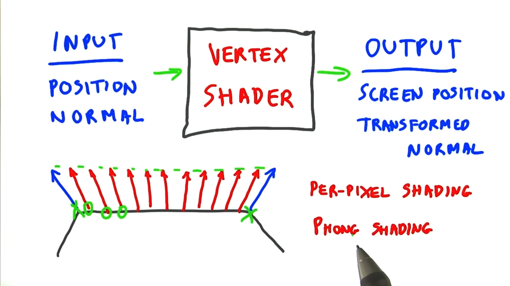

Phong is more expensive, but needed for good specular highlight.

Phong is 100 to 1 times more expensive than Gourad shading.

## Transparency

Transparent objects are more challenging.

1. Light refracts, or changes direction when it hits a transparent surface.

## Blending

Simple way to think of transparency.

Screen door transparency.

Only supports two objects and only a 50/50 mix look good.

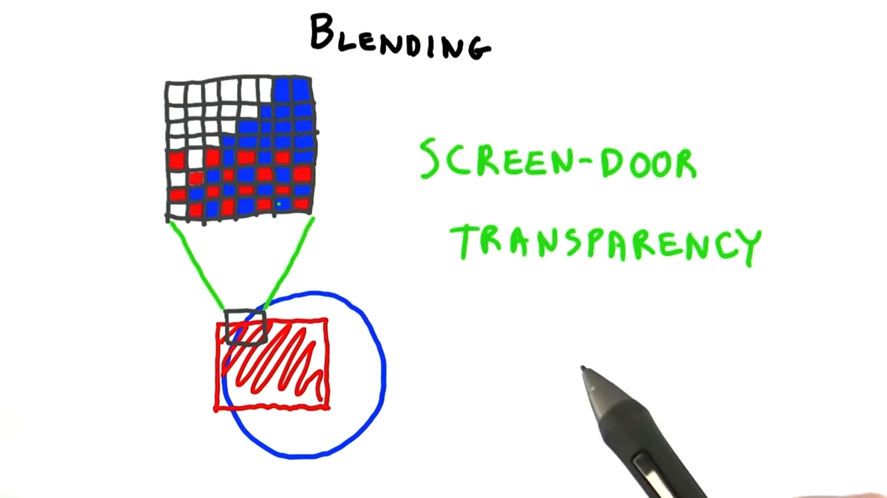
