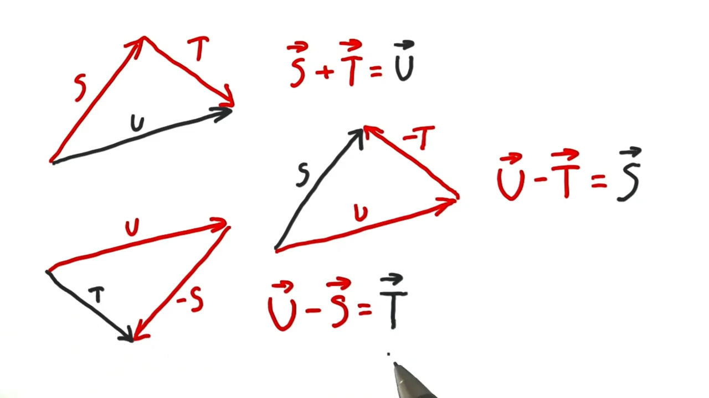

# Transforms

Used as a *noun*.

Where *transform* is a mathematical term meaning an operation that changes the position, orientation, or size and shape of an object.

The study of transforms is associated with *Linear Algebra*.

## Point and Vector Operations

* Point - position
* Vector - motion

* Point Subtraction - Subtracting Point A from Point B provides a vector V for how to get from Point A to Point B.

*Reverse is also true*.

* Point Vector Addition - Add Vector V to Point A to get to Point B.

Adding two points is not geometrically meaningful.

* Vector Addition - S + T = U
* Vector Subtraction - U - T = S
  * Adding a vector going the opposite direction, adding a negative vector.



* Scalar Multiplication
  * Point - Scale an object
  * Vector - Scale a vector

## Rotation
Three.js uses radians for rotations.

## Euler Angles
Three.js uses a X, Y, Z intrinsic rotation order, or Z, Y, X extrinsic rotation order by default.

This means that the object will first be rotated around its X axis, then its Y axis and finally its Z axis.

Three.js uses intrinsic Tait-Bryan angles. This means that rotations are performed with respect to the local coordinate system.

That is, for order 'XYZ', the rotation is first around the local-X axis (which is the same as the world-X axis), then around local-Y (which may now be different from the world Y-axis), then local-Z (which may be different from the world Z-axis).

**Source:** https://threejs.org/docs/#api/en/math/Euler

## Rigid Body Transforms vs. Scaling

Rigid Body:
* Translate
* Rotate

When we translate or rotate, we don't change an object's shape. As if the object were made out of something "rigid".

Scaling is *not* a "rigid body" transform.

**Uniform Scaling**
* Scale an object the same amount in all directions.
* Does not change any angles within the model itself.

As opposed to **Non-uniform Scaling** - the opposite.

## Scale Rotate Translate

**Order matters** for:

1. Rotation
2. and Scaling

but not Translation.

Three.js applies these operations in the following order:

1. Scale
2. Rotate
3. Translate

## Three.js Editor

The three.js interactive scene editor:
https://threejs.org/editor/

## Chaging Order of Operations

You can create a new `Object3D` to change the order of scale, rotate, translate.

```js
const block = new THREE.Mesh(
  new THREE.CubeGeometry(100, 4, 4), material
);
// translate first
block.position.x = 40;

const clockHand = new THREE.Object3D();
clockHand.add(block);

// and rotate after
clockHand.rotaion.y = -70 * Math.PI / 180;

scene.add(clockHand);
```

Right to left.
```
T R S O
<------
```
"Trash", "Trees".

Where:

* `O` - Object
* `S` - Scale
* `R` - Rotate
* `T` - Transform

## Hierarchy of Objects

`Object3D` creates a parent-child relationshipt between 2 objects.

Once an object is a child of another object, that child is affected by whatever is done to the parent.

## Instancing
A set of triangles or geometry can be re-used again and again.

This reduces memory and can increase GPU performance.
