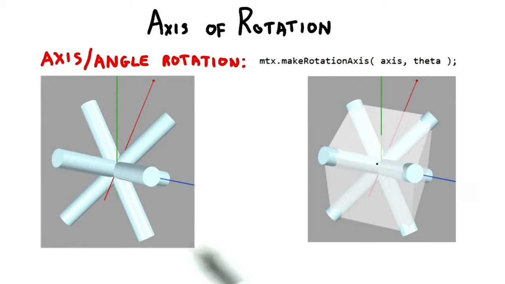
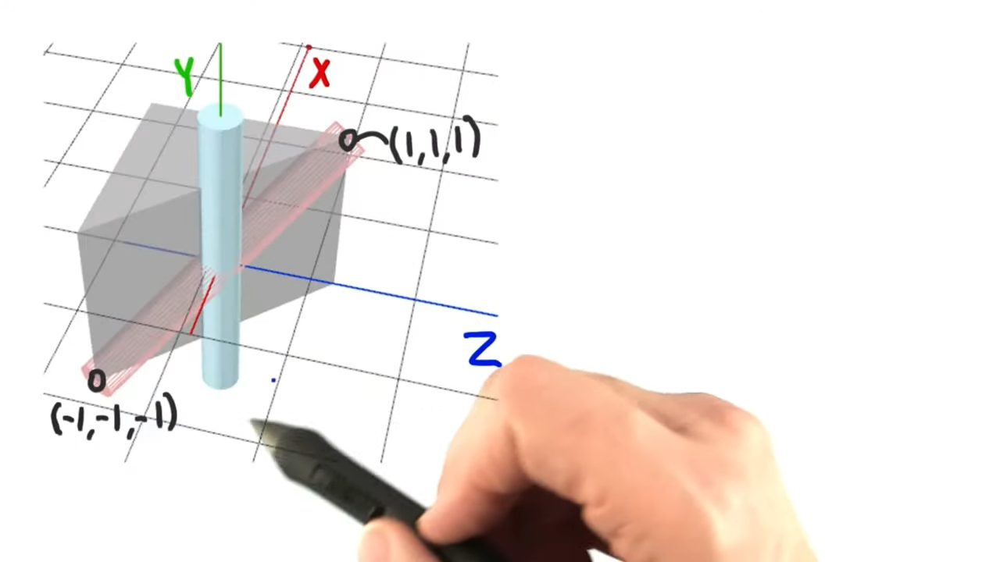
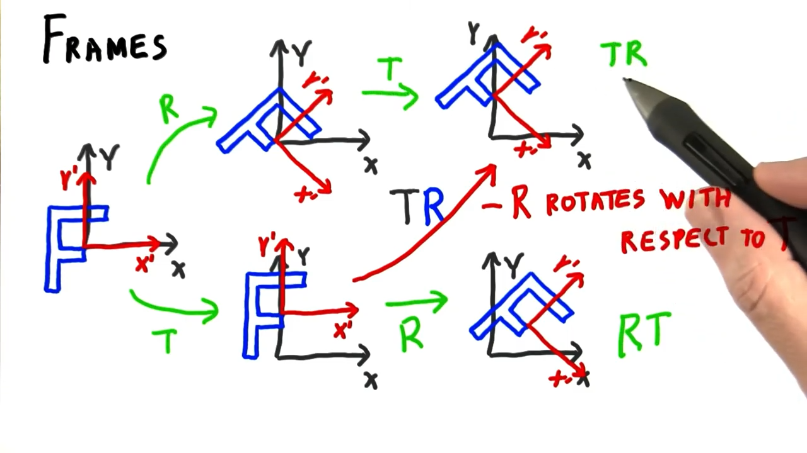
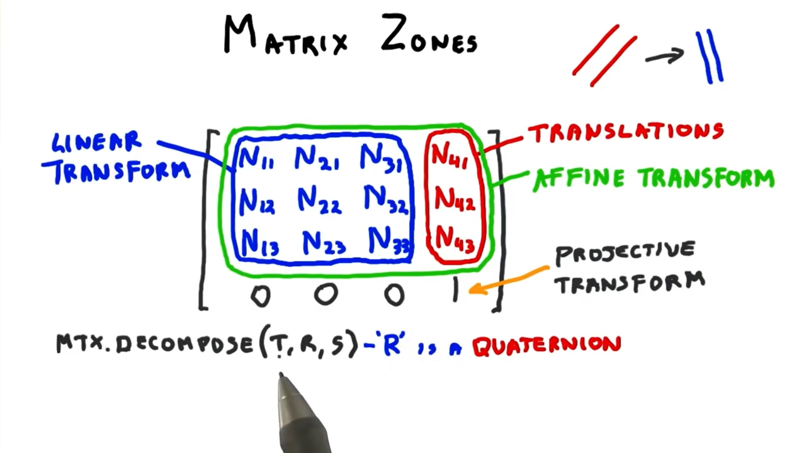

# Lesson 5: Matrices

## Matrix Math
To multiply a coordinate by a matrix, you perform a [**dot product** ](https://en.wikipedia.org/wiki/Dot_product)between the coordinate and each row in the matrix.

## The Fourth Coordinate

* **Point** - (x, y, z, **1**)
* **Vector** - (x, y, z, **0**)

|Binary Operation|Operand A|Operand B|Result|Fourth Coordinate|
|---|---|---|---|---|
|Addition|Vector|Vector|Vector|0 + 0 = 0|
|Subtraction|Vector|Vector|Vector|0 - 0 = 0|
|Addition|Point|Vector|Point|1 + 0 = 1|
|Subtraction|Point|Point|Vector|1 - 1 = 0|
|Addition|Point|Point|**Illegal!**|1 + 1 = 2|

## Identity Matrix
Usual default setting for a matrix.

Matrix with zeroes everywhere, and ones along the diagonal.

When multiplied with a coordinate, always results in the coordinate itself.

```js
const matrix = new THREE.Matrix4();

// reset matrix to identity
matrix.identity();
```

## Translation Matrix
Like an identity matrix, but translation movement is in the top 3 positions of the fourth column.
```
1 0 0 Tx
0 1 0 Ty
0 0 1 Tz
0 0 0 1
```
In **Column-Major Form**.

There is also *row-major form*.

WebGL and most publications use Column-Major form.

In memory:
```
1 0 0 0 0 1 0 0 0 0 1 0 Tx Ty Tz 1
```

(*same in WebGL & DirectX*)

## Using a Matrix
```js
const matrix = new THREE.Matrix4(
    1, 0, 0, 12,
    0, 1, 0, 16,
    0, 0, 1, -5,
    0, 0, 0, 1,
);
```
(*stored in memory differently*)

```js
const matrix = new THREE.Matrix4();
matrix.makeTranslation(x, y, z);
object3d.matrix = matrix;
// Don't use .position .rotation and .scale!
object3d.matrixAutoUpdate = false;
```

## Rotation Matrix

Rz
```
  cos(θ) -sin(θ)       0       0
  sin(θ)  cos(θ)       0       0
  0       0            1       0
  0       0            0       1
```

Third row is `(0, 0, 1, 0)` leaving Z-values unchanged during rotation about the Z-axis.

Two ways of thinking about it:

1. Rotating a point about the world axes
2. Rotating the world axes to local axes, and see where point lies with respect to local axis.
    * A dot product between two normalized vectors gives us the cosine of the angle between them.

Both interpretations are correct and have their own strengths.

## Basis

* Transformed world axes, or local axes are known as a **basis**.

## Axis-Angle Representation

```js
const matrix = new THREE.Matrix4();
matrix.makeRotationAxis(axis, theta);
```





```js
// better name might be Coordinate3
// to differentiate between Point and Vector
const maxCorner = new THREE.Vector3(1, 1, 1);
const minCorner = new THREE.Vector3(-1, -1, -1);
const cylinderAxis = new THREE.Vector3();
cylinderAxis.subVectors(maxCorner, minCorner);
const cylinderLength = cylinderAxis.length();

cylinderAxis.normalize();
// could use cylinderAxis.y instead of new THREE.Vector3(0, 1, 0) for performance
const theta = cylinderAxis = Math.acos(
    cylinderAxis.dot(new THREE.Vector3(0, 1, 0))
);
```

> Negate and try again

## Cross Product
A [**cross product**](https://en.wikipedia.org/wiki/Cross_product) can compute the axis of rotation.

```js
const rotationAxis = new THREE.Vector3();
rotationAxis.crossVectors(cylinderAxis, new THREE.Vector3(0, 1, 0));

// negative rotation axis
rotationAxis.crossVectors(new THREE.Vector3(0, 1, 0), cylinderAxis);

// special case
// two vectors are:
// 1) pointing in the same direction
// 2) or point in opposite directions
if (rotationAxis.length() == 0) {
    // pick an arbitrary axis perpendicular to axis of rotation
    // x axis is perpendicular to y axis
    rotationAxis.set(1, 0, 0);
}
```

**Additional Reading:** [Efficiently Building a Matrix to Rotate One Vector to Another](http://cs.brown.edu/research/pubs/pdfs/1999/Moller-1999-EBA.pdf)

The above paper can solve this problem in a *general way*.

Given a **vector** `A` and `B`:
```
A = (Ax, Ay, Az)
B = (Bx, By, Bz)
```

The length of the vector resulting from the cross-product between these vectors is:
```
Length(A X B) = sin(θ) * Length(A) * Length(B)
```

Where:
```
A X B = (AyBz - AzBy, AzBx - AxBz, AxBy - AyBx)
```

1. top left, to bottom right, *minus*
2. top rigth, to bottom left

New computed vector:
* describes the axis of rotation between the two vectors
* is perpendicular to both vectors
* typically want to normalize this vector if you use it late as it's length is usually obscure

## Rotation Times Rotation

```
T Rx Ry Rz S O
<-------------
```
`Object3D.matrix` is the above matrices concatenated together.

## World Matrix
World matrix or model matrix.

This includeds the child object's matrix multiplied by it's parent matrices.

```
Mc * Mw * Mh
```

* `Mc` - Matrix of car
* `Mw` - Matrix of wheel
* `Mh` - Matrix of hub

## Frames
Intead of transforming the object, another way to think about it is you change the frame of reference for the object.

The first matrix to the right of some given set of matrices is transforming the object with respect to that set (e.g. everything to the left of it).



* `TR` - Translation happens with respect to the world. Rotation happens with respect to a new translated frame of reference.
* `RT` - Rotation happens with respect to the world. Translation happens with respect to a new rotated frame of reference.

Typlically matrix operations are read right-to-left,bu the above is the left-to-right interpretation.

See:
http://www.realtimerendering.com/blog/two-ways-to-think-about-transforms/

## Scale Matrix & Normal

Scaling Matrix:
```
Sx  0  0  0
 0 Sy  0  0
 0  0 Sz  0
 0  0  0  1
```

Scaling can mess up normals used in shading.

Translation and rotation don't mess up normals.

* Uniform Scaling
    * Re-normalize normals before using it in lighting equations
* Non-uniform Scaling
    * Skews normals
    * Invert and transpose a matrix

## Transpose

M
```
A E I M
B F J N
C G K O
D H L 1
```

Transpose(M)
```
A B C D
E F G H
I J K L
M N O 1
```

## Inverse

### Definition
The inverse of a matrix essentially "undoes" the work of that matrix.

```
M * M^-1 = I
```

Where:

* M - Matrix
* M^-1 - Inverse of Matrix `M`
* I - Identity Matrix

### Translation
Translation Matrix
```
1 0 0 Tx
0 1 0 Ty
0 0 1 Tz
0 0 0 1
```

Inverse (negate Tx, Ty, and Tz)
```
1 0 0 -Tx
0 1 0 -Ty
0 0 1 -Tz
0 0 0 1
```

### Rotation (Rz)

Rotation Matrix (Rz)
```
  cos(θ) -sin(θ)       0       0
  sin(θ)  cos(θ)       0       0
  0       0            1       0
  0       0            0       1
```

Inverse (transpose)
```
 cos(θ)  sin(θ)       0       0
-sin(θ)  cos(θ)       0       0
  0      0            1       0
  0      0            0       1
```

### Scale

Rotation Matrix (Rz)
```
Sx  0  0  0
 0 Sy  0  0
 0  0 Sz  0
 0  0  0  1
```

Inverse ([multiplicative inverse](https://en.wikipedia.org/wiki/Multiplicative_inverse))
```
1/Sx    0    0    0
   0 1/Sy    0    0
   0    0 1/Sz    0
   0    0    0    1
```


### Three.js
```js
matrix.invert();
```
https://threejs.org/docs/#api/en/math/Matrix4.invert

## How to Correct Non-Uniformally Scaled Shading Normals

Transpose of the inverse **OR** Inverse of the Transpose.

* **Translation** - Doesn't affect vectors.
* **Rotation** - Transpose is the inverse. Two transposes results in the same rotation matrix. No effect.
* **Scale**
  * If uniform, re-normalize the normals.
  * If non-uniform, compute the transpose of the inverse (or inverse of the transpose). (*costly to compute all the time*)

## Mirroring (Reflection)

Mirror Matrix
```
Mx  0  0  0
 0 My  0  0
 0  0 Mz  0
 0  0  0  1
```
Where one of `Mx`, `My`, `Mz` is -1, and the others are `1`.

Mirror about z-axis.
```
 1  0  0  0
 0  1  0  0
 0  0 -1  0
 0  0  0  1
```
```js
object3d.scale.z = -1;
```

Caveats:
* Flips from right-hand to left-hand system
* Backface culling - you may have to reverse from `THREE.FrontSide` to `THREE.BackSide`.
* Also affects lighting -- making it look like lights come from the opposite direction.

How to determine if it's a mirror?

```js
if (matrix.determinant() < 0) {
    // mirror!
}
```

## Matrix Zones
```
N11 N21 N31 N41
N12 N22 N32 N42
N13 N23 N33 N43
0     0   0   1
```
Upper left, 3x3 matrix is for **linear transforms**:
* Rotations
* and Scales

Right-most column, or fourth column is for **translations**.

[Matrix4.decompose](https://threejs.org/docs/#api/en/math/Matrix4.decompose) can be used to extract position, rotation and scale all at once.

* Position and scale come back as vectors
* Rotation comes back as a quaternion.

**Affine Transforms** - Parallel lines stay parallel when an affine transformation is applied (top 3 rows).

As opposed to *projective transform* (bottom fourth row). Fourth coordinate is modified to something other than 1.


