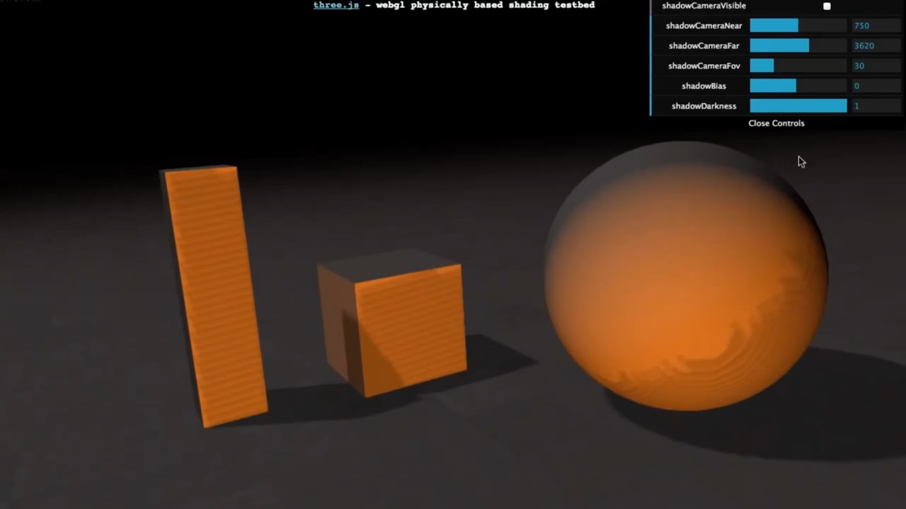

# Lesson 6: Lights

## Photons as Particles


* Each light or "*emitter*" sends photons out
* Each photon is absorbed or reflected
  * Every object absorbs some light (even highest quality mirrors)
* Along the way photons can be absorbed by dust, water droplets, or other particles in the air.

This simple photon model ignores various effects such as:

* polarization
* and fluorescence

## Directional Light

* Simplest type of light
* Defined by direction vector
* Like the sun
  * Essentially the same for every object on Earth
  * Infinitely far away
* You manipulate the direction, not location of the light.

```js
const light = new THREE.DirectionalLight(0xFFFFFF, 0.7);
// set direction vector of infinitely far away light
light.position.set(200, 500, 600);
scene.add(light);
```

Length of direction vector doesn't matter.

The following position is equivalent to the above:
```js
light.position.set(2, 5, 6);
light.position.set(0.2, 0.5, 0.6);
```

## Point Light

* Define a position
* Gives off light in all directions
* Different from real world lights in that, by default, distance from light doesn't affect brightness.
* [Attenuation](https://en.wikipedia.org/wiki/Attenuation) is not done, mostly, because it's easier to light a scene if there's no drop-off in distance.
* Possible to use a different equation for how the light is attenuated by the distance.
  * Divide the intensity by the distance
  * Divide the instensity by the distance squared.
  * Three.js supports only 1 drop-off mode. A max distance where the intensity goes to zero. Non-physical, but useful.

## Ambient Light

### General Notes
We don't use a drop-off of intensity by the distance squared because:
* Light only affects what it directly hits.
* No light bouncing around -- it dies off very quickly.

We compensate for this lack of reflected light, called *indirect illumination*, by adding a "fudge factor" -- called *ambient lighting*.


The light color is multiplied by the material's color to give a solid color.

The ambient color on a material is a separate color in Three.js.

If you don't set it, the ambient is white, and ambient light will add gray to the object.

Better to set the ambient to match the diffuse color.

Then use ambient light's intensity to change the feel of the scene as a whole.
```js
const ambientLight = new THREE.AmbientLight(0x222222);

const material = new THREE.MeshLambertMaterial({color: new THREE.Color(0.8, 0.2, 0.2)});
// set the ambient to match the diffuse color
material.ambient.copy(material.color);
```

## [Spot Light](https://threejs.org/docs/#api/en/lights/SpotLight)

* Like a point light, has position
* Like a directional light, have to point it somewhere

**One Important Addition**
Control of the cone of light it forms.

Angle where spot light ends - `angle`.

## Deferred Rendering

Lights are expensive.

Every light is yet another light that must be evaluated for a surface.

One way around this is *deferred rendering*.

Normally when you render a surface the fragment color for each pixel is stored, if it's the closest visible object. Called *forward rendering*.


In *Deferred Rendering*, you instead store data of some sort at each pixel.

Many variations like *deferred shading* and *deferred lighting*.

Every point light has an upper limit as to how far the light goes. It forms a volume in space (e.g. sphere, screen-aligned rectangle).

Whatever surface inside volume is affected by light.

A huge number of lights with a limited volume can be evaluated in this way.

Geometry's purpose is to test only the pixels in range of the light.

As opposed to standard lights, where every light is evaluated for every surface at every pixel.


## Shadow Mapping

Render the scene from the point of the view of the light.

If a light doesn't see a surface, the surface is in shadow.

[Casting Curved Shadows on Curved Surfaces, Lance Williams 1978](http://artis.imag.fr/~Cyril.Soler/DEA/Ombres/Papers/William.Sig78.pdf)


The shadow map algorithm creates a shadow image of the scene from the light's view, called the *shadow buffer*. This is similar to the z-buffer.

(*black closer to the light*)


## Shadows in Three.js

In Three.js, shadows must be enabled and are disabled by default.

```js
renderer.shadowMap.enabled = true;

spotLight.castShadow = true;

object3D.castShadow = true;
object3D.receiveShadow = true;
```

## Shadow Buffer Limitations


**Surface Acne** - Problem where dark patches show up where light patches should be.

**Peter Panning** - Increasing *shadow bias* causes object to appear to float, like Peter Pan.

### Surface Acne



### Peter Panning


## Ray Tracing

**Local Illumination Models** - An object is affected by a light and the result is sent to the eye. Light only comes from light sources. Not reflected by any other objects.

Many more light paths can be tracked. One rendering technique to simulate these is called **ray tracing**.

Capable of producing:

* shadows
* sharp reflections
* and refraction


## What paths are not covered by ray tracing?

* Light -> Object -> Diffuse object
* Light -> Mirror object

Any paths from lights are ignored in classical ray tracing.

## Path Tracing
Tracking the various paths that light can take to reach the light.

Shoot a lot more rays per pixel and bounce them around in hopes of finding light sources.

Called *path tracing*.

Noisy to start, but can get a realistic result given enough time.

> Path tracing is a realistic lighting algorithm that simulates light bouncing around a scene. 

http://madebyevan.com/webgl-path-tracing/

## Umbra & Penumbra

Not captured well by *shadow mapping*.

Shadow mapping assumes light comes from an infinitesimal point.

All lights have an area.


